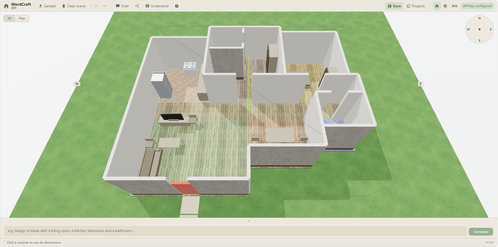
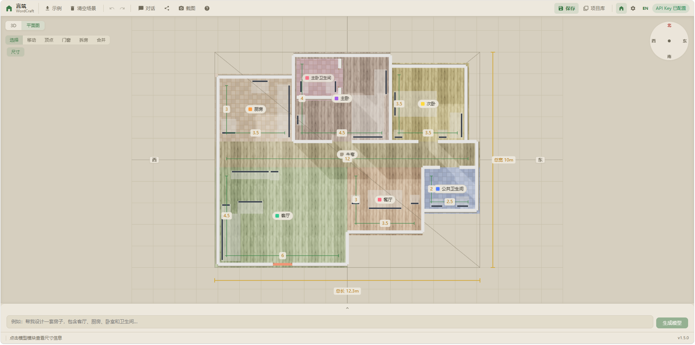

# 言筑（WordCraft）

> 纯前端「文生 3D」房屋设计器——用一句话描述你的房子，AI 生成可编辑的 3D 空间模型。

🛑 **建议在电脑端打开**：本站为桌面浏览器设计，移动端仅做了少量适配（横屏 + 紧凑布局）。为保证最佳体验，请使用电脑访问。

🚀 **在线体验**：<https://joyfish666.github.io/WordCraft/>

- GitHub Pages 部署 · 零后端 · 数据全在本地
- 首次打开可点「示例」或空态卡里的示例标签查看现成户型

<p align="center">
  
  <br />
  
</p>

📄 [English README](README.md) · [设计方案](docs/design.md) · [技术架构](docs/architecture.md) · [版本演进](docs/history.md) · [开发注意事项](docs/notes.md)

## 核心特性

- 🚀 **文生 3D**：一句话描述需求（如"三室一厅一厨，一个公共卫生间"），大模型输出操作序列（ops），代码逐条确定性执行成 3D 户型，多轮对话只做局部修改
- 🔄 **双向同步**：手动编辑（拖拽/改尺寸）自动记录为操作日志回流对话——AI 始终基于你改过的版本继续，不会被旧快照覆盖
- 🎨 **全新暖色浅色 UI**：米纸主题 + 无侧边栏全宽画布；顶栏分组工具栏（示例/清空/撤销重做/保存/截图等）；**底部对话抽屉**（折叠仅剩输入条，不占画布）；无场景时**空态引导卡**（一句话生成 + 可点击示例标签）；**属性面板可拖动**；未配置 API Key 时引导可先加载示例
- 🧭 **方向一致**：世界锚定罗盘 + 右上角投影罗盘；3D 与平面图同向——**上北下南、左西右东**（标准地图方向），东/西/南/北处处一致
- 🏠 **房屋造型材质层（写实化）**：程序化材质（木地板/瓷砖/织物/金属/外墙抹灰…，零外部资源）按房间类型与家具种类自动匹配；地板保留淡暖识别色、墙身中性化；踢脚线/门套/窗框/外墙基座勒脚细节；**写实光照**（ACES 色调映射 + 程序化天空与地平线雾 + 环境反射 + 软阴影，全部零外部资源）；室外草地与入户石板小径（正对门洞）；**无屋顶遮挡、内部一览无余**——阴影可在设置页开关
- 🔧 **精准编辑**：属性面板（精确数值）+ Gizmo 手柄（直观拖动）双模式，支持撤销/重做；**平面图自由编辑**（拖顶点改形状 / 拖房间 / 点墙放门窗 / 画墙拆房 / 合并房间，全操作可撤销并回流对话）；**平面图增强**（家具足迹 / 门洞符号 / 房间尺寸线，尺寸标注可一键开关）
- 🔒 **隐私优先**：纯前端，对话 / 模型 / API Key 全存本地，Key 自己掌控
- 📱 **移动端横屏支持**：竖屏提示旋转屏幕至横屏使用；窄横屏自动切换紧凑布局，平面图工具栏改为「工具」（呼出面板）与「尺寸」两个独立常驻按钮 + 罗盘缩小（桌面端不受影响）
- 📤 **便捷分享**：一键生成高清设计图 + 分享口令，粘贴即可还原；顶栏「截图」按钮可单独下载无水印 PNG
- 🌐 **开源协作**：MIT 开源，欢迎贡献

## 快速开始

1. **填 Key**：设置页填入大模型 API Key（默认 DeepSeek，支持 OpenAI 兼容接口）
2. **生成**：打开首页，可直接点击画布中央的示例标签（三室一厅一厨 / 现代简约小屋 / 书房工作室），或在底部抽屉输入需求 → 生成 3D 模型；可多轮对话修改细节
3. **编辑**：点击 3D 场景中的房间/家具 → 右侧属性面板改尺寸/位置（面板可拖动），或选中后用 Gizmo 手柄拖动
4. **看平面图**：左上角「3D / 平面图」一键切换俯视图；平面图模式下用左上工具栏直接编辑（移动/拖顶点/放门窗/拆房/合并）
5. **分享**：工具栏「分享」生成高清设计图 + 口令，对方粘贴口令即可还原；「截图」直接下载当前视角 PNG
6. **视角**：方向键 / WASD 平移，R 复位视角

## 技术栈

| 层级 | 技术选型 | 说明 |
|------|----------|------|
| 前端框架 | **React 18** | 组件化开发，生态成熟 |
| 3D 渲染 | **React Three Fiber** | 声明式 Three.js 封装，React 组件构建 3D 场景 |
| 3D 交互 | **@react-three/drei** | OrbitControls（视角）、TransformControls（Gizmo 编辑）等 |
| 状态管理 | **Zustand** | 轻量级全局状态，适合编辑器类应用 |
| 数据验证 | **Zod** | 定义 LLM 输出的 JSON Schema，确保数据结构正确性 |
| 本地存储 | **IndexedDB (Dexie.js)** | 存储大型模型数据和用户配置 |
| 口令压缩 | **lz-string** | 高效的 JSON 数据压缩算法 |
| HTTP 请求 | **fetch（SSE 流式）** | OpenAI 兼容 chat/completions，统一 fetch 栈 |
| 构建工具 | **Vite** | 快速的开发构建工具 |
| 测试框架 | **Vitest + Testing Library** | 单元测试与组件测试（700+ 用例，CI 强制执行） |

## 项目文档

| 文档 | 内容 |
|------|------|
| [docs/design.md](docs/design.md) | 当前设计方案：v3 架构（操作契约 + 足迹几何 + 双向同步 + 平面图自由编辑，P1/P2/P3/P4 已实施） |
| [docs/architecture.md](docs/architecture.md) | 现行实现的技术架构与数据契约（v3 足迹模型 + ops 操作契约） |
| [docs/history.md](docs/history.md) | 三代架构演进的关键决策记录 |
| [docs/notes.md](docs/notes.md) | 开发注意事项与踩坑记录，改代码前必读 |

## 本地开发

```bash
npm install
npm run dev      # 开发，http://localhost:5173
npm run test     # Vitest 单元测试
npm run lint     # ESLint
npm run build    # 类型检查 + 构建
```

## 部署（GitHub Pages）

推送到 `main` 分支即触发 `.github/workflows/deploy.yml` 自动构建并部署到 GitHub Pages（构建前先跑测试，测试失败不会部署）：

1. **首次配置**：仓库 Settings → Pages → Source 选择 **GitHub Actions**；
2. 构建产物以项目站点路径部署（`vite.config.ts` 的 `base=/WordCraft/`，仓库名为 WordCraft）；
3. 深链接（如直接访问 `/WordCraft/settings` 刷新）由 `public/404.html` + `index.html` 内联脚本自动还原（坑 89）；
4. **改仓库名或 `base` 时**需同步 `public/404.html` 的 `pathSegmentsToKeep`（段数 = 仓库名前缀段数，见 docs/notes.md 坑 89）。

本地预览构建产物：`npm run build && npm run preview`。

## 路线图

- [x] **v3 自由设计**：~~P1 数据模型 v3~~（足迹几何 + 迁移 + window 段，✅ 已完成）→ ~~P2 契约动词化~~（操作序列 + 执行器 + 提示词重写，✅ 已完成）→ ~~P3 双向同步~~（编辑日志回流对话 + 上下文精简，✅ 已完成）→ ~~P4 平面图自由编辑~~（拖顶点/拖房间/点墙放门窗/画墙拆房/合并房间，全操作可撤销，✅ 已完成）
- [x] **移动端基础适配**（横屏限定：竖屏提示旋转屏幕，✅ 已完成）
- [x] **2D 平面图增强**（家具足迹 / 门洞符号 / 尺寸标注，✅ 已完成）
- [x] **全新 UI 改版**（暖色浅色主题 / 无侧边栏 / 底部对话抽屉 / 空态引导卡 / 属性面板可拖动 / 截图按钮，✅ 已完成）
- [x] **房屋造型材质层 + 写实化**（程序化纹理 / 材质分类 / 踢脚线·门套·窗框·勒脚 / 写实光照（天空·雾·环境反射·软阴影）/ 屋顶移除，✅ 已完成）

## FAQ

**Q：API Key 从哪里获取？**
A：应用是纯前端，API Key 由你自己在设置页配置（支持 OpenAI 兼容接口，默认 DeepSeek）。Key 只存在浏览器本地（localStorage），不会上传到任何服务器。

**Q：英文界面下房间分类（走廊/卫生间等）不生效？**
A：分类词表已**中英双语化**（走廊/开放/私密/卫生间归属、20 类家具、独立/靠墙判定）：英文界面下 LLM 收到英文系统提示词并产出英文名，由各词表的英文半区匹配。真实边界：分类依赖名称命中词表——词表外的复合命名（如 "Master En-suite"）可能漏判。中文英文两套词表同步维护（`roomGeometry.ts` / `furniturePresets.ts` / `furniturePlacement.ts`）。

**Q：生成结果能保存和分享吗？**
A：可以。顶栏「保存」存入本地项目库（IndexedDB）；「分享」生成压缩口令 + 水印截图，对方粘贴口令即可还原模型（旧版本口令自动迁移）。

## 贡献指南

1. **Fork** 仓库：https://github.com/joyfish666/WordCraft
2. **创建分支**：`git checkout -b feature/amazing-feature`
3. **提交**：`git commit -m 'feat: add amazing feature'`
4. **推送**：`git push origin feature/amazing-feature`
5. **创建 Pull Request**

代码规范：遵循 ESLint + Prettier；确保 `npm test` 全绿。改代码前请先阅读 [开发注意事项](docs/notes.md)。

## 许可证

MIT — 详见 [LICENSE](LICENSE) 文件。

## 联系方式

- 项目主页：https://github.com/joyfish666/WordCraft
- 问题反馈：https://github.com/joyfish666/WordCraft/issues
- 讨论区：https://github.com/joyfish666/WordCraft/discussions
